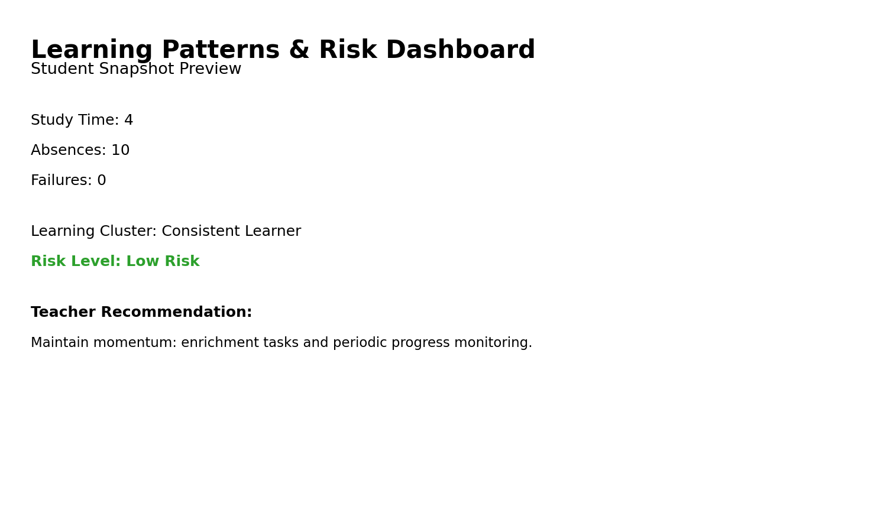
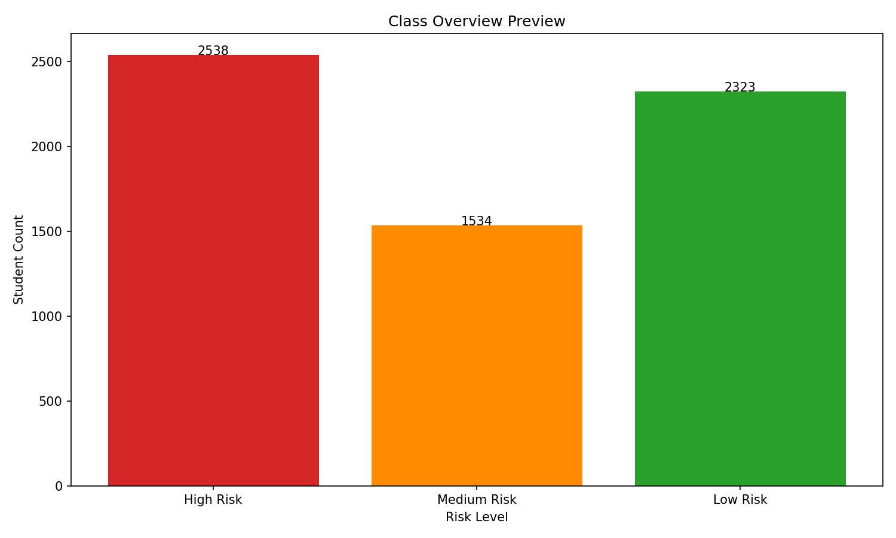

# learning-patterns-classroom-strategy
Learning Pattern Analysis &amp; Classroom Strategy Insights – Praxis 2.0 Hackathon (DSEU, New Delhi) 
TEAM - Solo (Team Name - EngineerWork)

## Current Status

### Phase 1 – Day 1
- Selected problem statement (PS-4: Learning Patterns & Classroom Strategy Insights)  
- Downloaded and reviewed dataset  
- Created GitHub repository and project structure  

### Phase 2 – Day 2
- Framed ML problem and learning objectives  
- Categorized features based on learning behavior  
- Completed initial data exploration and observations  

### Phase 3 – Day 3
- Data preprocessing and encoding  
- Baseline machine learning models  
- Learning pattern clustering and explainability  
- Strategy recommendation logic  

### Phase 3 – Day 4
- Performed learning pattern discovery using clustering techniques
- Identified meaningful student learning groups based on academic, engagement, and behavioral features
- Added interpretability to explain why students belong to specific learning patterns
- Visualized learning clusters to support classroom-level insights
- Designed initial strategy recommendation logic aligned to identified learning patterns

### Phase 4 -Day 5
 - Added feature importance–based explainability for ML predictions
 - Interpreted learning clusters in teacher-friendly language
 - Designed actionable teaching strategies for each learning pattern
 - Implemented early warning logic for disengagement detection
 - Connected ML outputs to classroom decision-making flow

### Phase 5 - Day 6
- Made a plan to build small dashboard
- Having:
  - Show student data
  - Show learning cluster
  - Show risk level
  - Show teacher recommendation

## System Architecture

Student Data (CSV)
|
Data Preprocessing & Encoding
|
Clustering (Learning Pattern Identification)
|
Risk Classification
|
Explainability Layer
|
Teacher Strategy Recommendation
|
Interactive Dashboard (Streamlit)

## Business Feasibility

This prototype can be integrated into:
- School ERP systems
- Learning Management Systems
- Institutional analytics dashboards

It can operate as a decision-support system to improve student engagement and reduce academic risk through early intervention.

## Ethical Considerations

- The system provides advisory insights, not final decisions.
- Predictions are based on historical data and may not capture personal context.
- Continuous evaluation is required to prevent bias.
- Human oversight is mandatory for intervention decisions.

## Dashboard Preview

## Day 7 Progress - Streamlit Dashboard Implementation

- Designed and implemented minimal Streamlit dashboard
- Integrated clustering logic into dashboard
- Integrated risk prediction logic
- Added student-level interactive insights

## Day 8 Progress - Streamlit Dashboard Updated

- Dashboard refined for cleaner demo and submission readiness
- Class summary metrics highlighted for faster judge interpretation
- No new ML models introduced; existing pipeline preserved
- Documentation updated for progress tracking and clarity

### Class-Level Overview Snapshot

- Total Students: 6395
- % High Risk: 39.7%
- % Medium Risk: 24.0%
- % Low Risk: 36.3%
## Day 9 Progress - Live Deployment

The Learning Patterns & Risk Dashboard is deployed on AWS EC2.

Live URL:
http://13.127.239.15:8501

Deployment Details:
- AWS EC2 (Ubuntu 22.04)
- Python Virtual Environment
- Streamlit Application Server
- Port 8501 exposed via Security Group

The system is now publicly accessible and cloud-hosted.
## Day 10 Progress - Production Deployment

The dashboard is deployed on AWS EC2 with a custom subdomain.

Live URL:
http://praxisproject.skillrouteai.com

Deployment Stack:
- AWS EC2 (Ubuntu)
- Nginx reverse proxy
- Streamlit application
- systemd auto-start service

